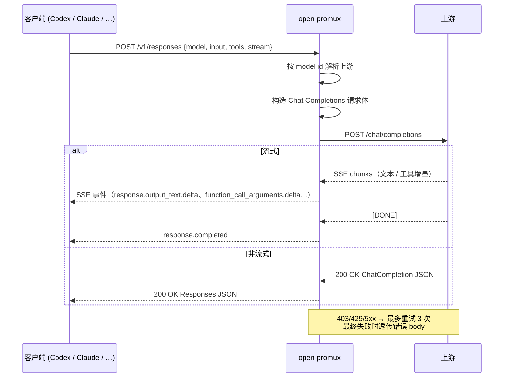

<div align="center">

# 🛰️ open-promux

**多上游 LLM API 网关 — 协议桥接、流量调度、模型融合，统一在一处。**

`open-promux` 把多个模型服务（OpenAI 兼容、Anthropic Messages、未来更多协议……）聚合到同一个入口，按 model id 路由，并附带一个 Tauri 2 桌面控制台用于实时状态、日志流，以及（即将到来的）使用统计。

[](https://www.rust-lang.org/)
[](https://tauri.app/)
[](https://github.com/tokio-rs/axum)
[](#license)
[](./README.md)

</div>

---

## ✨ 它是什么

```text
┌────────────┐                    ┌─────────────────┐                      ┌──────────────┐
│  任意 LLM  │                    │   open-promux   │   /chat/completions  │  OpenAI 兼容 │
│  客户端：  │  /v1/responses     │                 │ ───────────────────► │  Anthropic   │
│  Codex App │ ─────────────────► │  ┌───────────┐  │   /messages          │  本地 LLM    │
│  Claude SDK│  /v1/messages      │  │ 路由 + LB │  │ ───────────────────► │  ……          │
│  其他      │ ─────────────────► │  │ + 健康检查│  │   （即将更多）       │              │
│            │  /v1/chat/...      │  └───────────┘  │                      │              │
│            │ ─────────────────► │                 │                      │              │
└────────────┘                    └─────────────────┘                      └──────────────┘
                                            │
                                            ▼
                                    🖥️  Tauri 2 桌面控制台
                                  （状态 / 日志 / 即将：用量统计）
```

`open-promux` 起步是 Codex App ⇄ Chat Completions 的协议适配，
现在正在演化为通用 LLM API 网关：

- **协议桥接** — 当前支持 Responses API、Chat Completions、Anthropic Messages 互转，更多输出协议规划中。
- **多上游路由** — 配多个供应商，按 model id 自动路由、错误时自动故障转移、流量负载均衡。
- **模型融合** — 多家供应商的模型在同一个 catalog 下以 `name:model` 形式暴露。
- **可观测性** — Tauri 2 桌面控制台带实时日志，即将集成参考 `cc-switch` 的按模型用量统计。

---

## 🔥 功能亮点

| 类别 | 提供能力 |
| --- | --- |
| 🔁 **协议桥接** | `/v1/responses` ⇄ Chat Completions、原生 Anthropic Messages 输出、双向完整流式 SSE、工具调用翻译。 |
| 🌐 **多上游 catalog** | 跨上游聚合 `/v1/models`，以 `name:model` 暴露 id，普通 id 原样转发。 |
| ⚖️ **负载均衡** | 默认按配置顺序匹配，支持 `round_robin` 与可重试错误的自动故障转移。 |
| 🧪 **健康检查** | 对每个上游周期性探测 `/models`，路由时跳过不健康上游直至恢复。 |
| 🚦 **限流** | 可选全局与单上游 RPM / TPM / 并发限制，全部 opt-in。 |
| 🛠️ **工具调用适配** | 跨格式翻译 `tools`、`tool_choice` 与流式参数增量。 |
| ♻️ **重试与透传** | `403 / 429 / 5xx` 与连接错误自动重试（最多 3 次），其他错误原样透传上游 body。 |
| 🔐 **灵活认证** | 默认 `Authorization: Bearer <key>`；支持 `api-key` 等自定义 header，每个上游独立配置。 |
| 🖥️ **桌面控制台** | Tauri 2 应用，终端控制台风格，自带托盘、自启、虚拟滚动日志流、EN / 中 双语界面。 |
| 📡 **Anthropic / Responses 下游** | `/v1/messages` 接收 Anthropic Messages；`/v1/chat/completions` 现在也能接 Anthropic / Responses 上游（非流式）。 |
| 🌀 **Responses 上游** | `api_format = "responses"` 让上游本身说 Responses API；`/v1/responses` 走完全直通（完整流式 SSE），`/v1/messages` / `/v1/chat/completions` 均可转换。 |
| 📊 **流量统计** | 按模型 / 按上游的实时计数器：请求 / 成功 / 失败 / 入出字节 / 延迟平均 & 最大。桌面控制台 Stats 页可见。 |
| 🚀 **性能** | 每上游一个长连接 `reqwest` client，自动协商 HTTP/2，Tokio 多线程 runtime。 |

<details>
<summary><strong>📚 完整功能列表（点击展开）</strong></summary>

### Responses API → Chat Completions
- 将 `/v1/responses` 请求转为上游 Chat Completions 请求。
- `instructions` 转为 system message。
- 支持字符串输入与完整 `input[]` 对话上下文。
- 保留 user / assistant / tool 等消息顺序。
- 映射 `max_output_tokens`、`temperature`、`top_p` 等常用参数。

### Chat Completions → Responses API
- 上游非流式响应转为 Responses API JSON。
- 文本输出转为 `message` output item。
- `tool_calls` 转为 `function_call` output item。
- 生成 Responses 兼容的 response id、output、usage、status 字段。

### 流式 SSE
- 上游 Chat Completions SSE 转为 `response.created`、`response.in_progress`、`response.output_item.added`、`response.output_text.delta`、`response.completed` 等事件。
- SSE 解码器正确处理 TCP 分片、半包、跨 chunk 事件。
- 多字节安全（中文、emoji 等）— 字节断在字符中间也不损坏。
- 上游直接发 `[DONE]` 或断连时兜底完成未结束输出项。

### 多上游路由
- 同时兼容旧版 `[upstream]` 与新版 `[[upstreams]]` 配置。
- `/v1/models` 聚合所有上游模型列表；带 `name` 时显示为 `name:model`。
- 普通模型名原样转发；`name:model` 自动剥离前缀再发给对应上游。
- 默认按配置顺序选第一个匹配上游；可选 `round_robin` 在同模型候选间轮转。
- 可选自动故障转移：可重试错误后自动切下一个匹配上游。
- 可选健康检查：路由时跳过不健康上游。
- 多上游模式启动后预拉取模型列表并短时缓存，减少重复访问 `/models`。

### 性能与连接复用
- 每个上游一个长生命周期 `reqwest` client + 连接池。
- 上游支持时自动协商 HTTP/2 多路复用。
- Tokio 多线程异步 runtime，不为每请求开线程。
- 可选每上游并发上限：`[performance].upstream_max_concurrent_requests`。
- 可选全局与单上游 RPM / TPM 限流，固定 60 秒窗口。

### 认证
- `auth_header` 省略或为空 → 用标准 `Authorization`。
- `Authorization` + 原始 key → 自动加 `Bearer ` 前缀。
- key 已含 `Bearer ` 前缀时不重复添加。
- 自定义 header（如 `api-key`）原样发送 `api_key` 值。

</details>

---

## 🗺️ 路线图

`open-promux` 正在从单一用途的 Codex 适配器扩展为通用网关。当前方向：

| 阶段 | 内容 |
| --- | --- |
| **当前** | 三种协议双端都是一等公民：Responses ⇄ Chat Completions ⇄ Anthropic Messages，包含 `api_format = "responses"` 上游的直通模式。`/v1/responses`、`/v1/messages`、`/v1/chat/completions` 三个下游都可以路由到任意上游格式并自动转换。Responses 下游与 Anthropic 直通都支持流式 SSE。实时**流量统计**（桌面 Stats 页可见）。多上游路由、负载均衡、健康检查、重试、Tauri 2 桌面控制台（双语 UI）。 |
| **下一步** | 补齐 [「无极上下游」矩阵](#%E6%97%A0%E6%9E%81%E4%B8%8A%E4%B8%8B%E6%B8%B8%E7%9F%A9%E9%98%B5) 中剩余的 SSE 桥接（Chat 下游 对 Anthropic / Responses 上游；Anthropic 下游 对 Chat / Responses 上游的流式）。流量统计加上延迟 p50/p95/p99 与成本估算。桌面 UI 中的快速切换上游配置。 |
| **后续** | 更多输出协议（OpenAI Assistants、Gemini、Ollama 原生等）。成本核算、告警、请求重放、结构化审计日志。 |

如果有特别想优先做的功能，欢迎来提 issue。

---

## 🚀 快速开始

> 三种方式任选其一，底层都是同一个 Rust 内核。

### 🟢 方式 A — npm（最推荐）

```bash
npm install -g @grenanhao/open-promux
open-promux ./config.toml
```

### 🟢 方式 B — Cargo（源码构建）

```bash
git clone https://github.com/GrenAnHao/open-promux
cd open-promux
cargo run -- ./config.toml
```

### 🟢 方式 C — 桌面控制台（Tauri 2）

```bash
pnpm --dir desktop install
pnpm --dir desktop dev          # 热重载开发窗口
pnpm --dir desktop build        # 当前平台正式打包
```

桌面应用会从平台默认目录读写 `config.toml`：
- Windows：`%APPDATA%\open-promux\`
- Linux：`~/.config/open-promux/`
- macOS：`~/Library/Application Support/open-promux/`

如需共用 CLI 的 `./config.toml`，在 UI 里点击 **Set config path** 切换路径即可。

> 💡 各平台预编译二进制也可在
> [GitHub Releases](https://github.com/GrenAnHao/open-promux/releases) 直接下载。

---

## 🖥️ 桌面控制台

`desktop/` 目录下的 Tauri 2 前端把网关库直接嵌入同一个进程，不需要再开第二个终端：

| 页面 | 能做什么 |
| --- | --- |
| **Dashboard** | 实时状态（绑定地址 / 在线时长 / 在线指示灯）、上游探测表。 |
| **Upstreams** | 弹窗表单 CRUD：api_key、auth_header、weight、超时、proxy。 |
| **Routing** | 负载均衡 / 健康 / 故障转移 / 模型别名规则。 |
| **Logs** | 虚拟滚动日志流（每秒数千行也不卡顿），等级过滤、tail 开关、复制 / 清空。 |
| **Settings** | 端口、auth_key、性能、健康、矫正器、自启动、语言。 |
| **Stats** | 按模型 / 按上游的流量统计：请求次数、token 用量、延迟。 |

视觉风格：深碳底色（`#0B0F14`）+ 薄荷绿点缀（`#5BE7C4`），1px 边框，
等宽数据标签。窗口关闭时缩进托盘，左键托盘重新聚焦。Windows 自启动
写在用户级 Run 注册表项。

双语：英文 / 简体中文，可在顶栏或 Settings 切换；选择持久化在网关
配置旁边的 `desktop_preferences.toml` 文件中。

---

## ⚙️ 配置

`open-promux` 默认从项目根目录读取 `config.toml`。建议从
`config.example.toml` 起步，再按需求挑选下面的配置层级。

### Tier 1 — 最小（单上游 OpenAI 风格）

```toml
port     = 8080
auth_key = "proxy-secret"          # 保护网关本身；省略表示禁用代理鉴权

[upstream]
url     = "https://api.openai.com/v1"
api_key = "sk-your-api-key"
```

向上游发送 `Authorization: Bearer sk-your-api-key`，
向客户端要求 `Authorization: Bearer proxy-secret`。

### Tier 2 — 自定义认证 header

```toml
[upstream]
url         = "http://127.0.0.1:8000/v1"
api_key     = "your-secret"
auth_header = "api-key"            # 发送 `api-key: your-secret`，不加 Bearer
```

### Tier 3 — 多上游路由

```toml
port = 8080

[[upstreams]]
name    = "openai"
url     = "https://api.openai.com/v1"
api_key = "sk-your-api-key"

[[upstreams]]
name        = "local"
url         = "http://127.0.0.1:8000/v1"
api_key     = "your-secret"
auth_header = "api-key"
```

`GET /v1/models` 返回 `openai:gpt-4.1-mini`、`local:qwen3` 这样的模型 id。
请求带这种前缀时会路由到对应上游，并在转发前剥离 `name:` 前缀。

### Tier 4 — 高级

```toml
[performance]
upstream_max_concurrent_requests = 64
global_rpm                       = 600
global_tpm                       = 120000

[routing]
load_balance        = "round_robin"
automatic_failover  = true

[health]
enabled                  = true
interval_millis          = 30000
unhealthy_after_failures = 3
```

并发限制每请求占用一个 slot，流式响应直到流结束才释放；
RPM / TPM 限制使用固定 60 秒窗口。任何限制省略或设为 `0` 即关闭。

### 配置参考表

| 字段 | 必填 | 默认 | 说明 |
| --- | --- | --- | --- |
| `port` | 否 | `8080` | 本地监听端口 |
| `auth_key` | 否 | 空 | 客户端访问网关需要的 Bearer key；空表示禁用 |
| `upstream.url` / `upstreams[].url` | 必选其一 | — | 上游 base URL，通常以 `/v1` 结尾 |
| `upstream.api_key` / `upstreams[].api_key` | 否 | 空 | 上游认证 key |
| `upstream.auth_header` / `upstreams[].auth_header` | 否 | `Authorization` | 上游认证 header 名 |
| `upstreams[].name` | 否 | — | 路由前缀，生成 `name:model` |
| `routing.load_balance` | 否 | `first_match` | `first_match` 或 `round_robin` |
| `routing.automatic_failover` | 否 | `false` | 可重试错误后切下一个上游 |
| `health.enabled` | 否 | `false` | 周期性探测每上游 `/models` |
| `performance.*` | 否 | 未设 / `0` | 所有限流均 opt-in |

---

## 🔌 API

### `POST /v1/responses` — Responses API ⇄ Chat Completions

```bash
curl http://127.0.0.1:8080/v1/responses \
  -H "Content-Type: application/json" \
  -H "Authorization: Bearer proxy-secret" \
  -d '{
    "model": "gpt-4.1-mini",
    "input": "你好，请简单介绍下你自己"
  }'
```

流式、`instructions`、完整 `input[]` 多轮、工具调用 — 详见
下方 [转换流程](#-转换流程)。

### `POST /v1/messages` — Anthropic Messages 下游

```bash
curl http://127.0.0.1:8080/v1/messages \
  -H "Content-Type: application/json" \
  -H "Authorization: Bearer proxy-secret" \
  -d '{
    "model": "claude-3-5-sonnet-latest",
    "max_tokens": 1024,
    "messages": [
      {"role": "user", "content": "你好"}
    ]
  }'
```

### `POST /v1/messages` 不同上游路由行为

| 上游 `api_format` | 行为 |
| --- | --- |
| `anthropic_messages` | 直通转发；完整流式 SSE + rectifier + 重试。 |
| `chat_completions` | Anthropic ⇄ Chat 转换（当前仅非流式；流式返回 `501`，并提示使用已双向支持的 `/v1/responses`）。 |
| `responses` | Anthropic ⇄ Responses 转换（当前仅非流式；流式返回 `501`）。 |

### 「无极上下游」矩阵

下游协议 × 上游 `api_format` 完整矩阵：

| 下游 ↓ \ 上游 → | `chat_completions` | `anthropic_messages` | `responses` |
| --- | --- | --- | --- |
| `/v1/responses` | ✅ 流式 + 非流式 | ✅ 流式 + 非流式 | ✅ 流式 + 非流式 **直通** |
| `/v1/messages` | ✅ 非流式（流式 `501`） | ✅ 流式 + 非流式 **直通** | ✅ 非流式（流式 `501`） |
| `/v1/chat/completions` | ✅ 流式 + 非流式 **直通** | ✅ 非流式（流式 `501`） | ✅ 非流式（流式 `501`） |

**TL;DR**：客户端选下游协议；按提供方真实接口选上游 `api_format`；
两端格式一致时直通、不一致时网关翻译，对客户端无感。

### `POST /v1/chat/completions` — 直通代理

```bash
curl http://127.0.0.1:8080/v1/chat/completions \
  -H "Content-Type: application/json" \
  -d '{
    "model": "gpt-4.1-mini",
    "messages": [{ "role": "user", "content": "你好" }]
  }'
```

多上游模式下，请求里的 `model` 决定哪个上游接收请求。
本路由适合已经用 Chat Completions 的客户端。

### `GET /v1/models` — 合并模型列表

```bash
curl http://127.0.0.1:8080/v1/models
```

单上游 → 直接代理 `{upstream.url}/models`。
多上游 → 合并列表，`name` 存在时显示为 `name:model`。

---

## 🧠 转换流程



`/v1/responses` 与 `/v1/chat/completions` 的路由决策：

1. 解析请求并读取 `model`。
2. 与每个上游公布的模型列表匹配（带短时缓存）。
3. 必要时翻译请求体（Responses → Chat Completions / Anthropic Messages）。
4. 用对应认证 header 转发到 `{upstream.url}/...`。
5. 可重试错误 → 重试，必要时故障转移到下一个匹配上游。
6. 流式 / 非流式响应分别翻译后返回。

---

## 🛠️ 开发

```bash
cargo fmt --check
cargo test
cargo clippy --workspace -- -D warnings

# 桌面控制台
pnpm --dir desktop typecheck
pnpm --dir desktop build:renderer
```

**测试覆盖重点：**

- Responses `input[]` 完整往返
- `tools` / `tool_choice` 翻译
- `tool_calls` → `function_call` 映射（流式与非流式）
- SSE 半包 / 多字节字符处理
- `[DONE]` 没带 `finish_reason` 时的兜底完成
- 403 / 429 / 5xx 重试行为
- 多上游 `/v1/models` 聚合
- 按 `model` 自动选择上游
- 默认 `Authorization: Bearer <api_key>` 语义

---

## 📦 发布

打 GitHub Release：

```bash
git tag -a v0.2.0 -m "open-promux v0.2.0"
git push origin v0.2.0
```

通过 Actions 发布 npm 包：

```bash
gh secret set NPM_TOKEN
gh workflow run "Publish NPM"
```

`NPM_TOKEN` 需要是有 `@grenanhao/open-promux` 发布权限的 npm automation token。

---

## 📝 注意事项

- **不要把真实的 `api_key` 提交到版本库。** `config.toml` 默认已加入 gitignore。
- OpenAI 风格上游可省略 `auth_header`，自动用 `Authorization: Bearer`。
- 上游若用非标准 header，请显式设置 `auth_header`（如 `api-key`）。
- 只有 `403 / 429 / 5xx` 与连接错误会重试 — `401` 通常是鉴权失败，**不会**重试。
- 本仓库取代了 `openai-responses-proxy`；旧名字仍可作为入口使用，但新功能将在这里继续推进。

---

## License

MIT.

<div align="center">

由 🦀 Rust + ⚡ Axum + 🎨 Tauri 2 构建。

</div>
