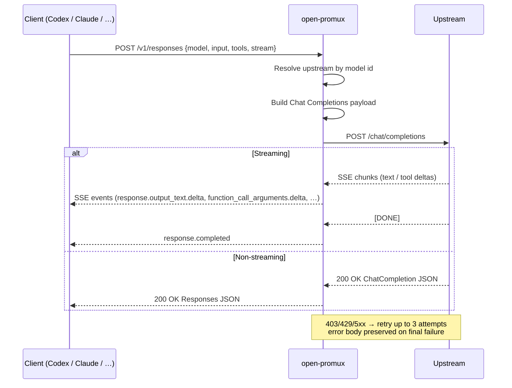

<div align="center">

# 🛰️ open-promux

**A multi-upstream LLM API gateway: protocol bridging, traffic shaping, and model fusion — under one roof.**

`open-promux` aggregates many providers (OpenAI-compatible, Anthropic Messages, future protocols…) behind one endpoint, routes by model id, and ships with a Tauri 2 desktop console for live status, log streaming, and (soon) usage analytics.

[](https://www.rust-lang.org/)
[](https://tauri.app/)
[](https://github.com/tokio-rs/axum)
[](#license)
[](./README-CN.md)

</div>

---

## ✨ What it is

```text
┌────────────┐                    ┌─────────────────┐                      ┌──────────────┐
│  Any LLM   │                    │   open-promux   │   /chat/completions  │  OpenAI-     │
│  client:   │  /v1/responses     │                 │ ───────────────────► │  compatible  │
│  Codex App │ ─────────────────► │  ┌───────────┐  │   /messages          │  Anthropic   │
│  Claude SDK│  /v1/messages      │  │  router   │  │ ───────────────────► │  local LLMs  │
│  any other │ ─────────────────► │  │  + LB     │  │   (more soon)        │  ……          │
│            │  /v1/chat/...      │  │  + health │  │                      │              │
│            │ ─────────────────► │  └───────────┘  │                      │              │
└────────────┘                    └─────────────────┘                      └──────────────┘
                                            │
                                            ▼
                                   🖥️  Tauri 2 desktop console
                                   (status, logs, soon: usage stats)
```

`open-promux` started as a Codex App ⇄ Chat Completions adapter and is
evolving into a general-purpose LLM gateway:

- **Protocol bridge** — translate between Responses API, Chat Completions, and Anthropic Messages today; more output protocols planned.
- **Multi-upstream routing** — list any number of providers, route by model id, fail over on errors, balance load.
- **Model fusion** — expose models from many vendors under one merged catalog with `name:model` ids.
- **Operability** — Tauri 2 desktop console with real-time logs and (planned) per-model usage statistics inspired by `cc-switch`.

---

## 🔥 Highlights

| Area | What you get |
| --- | --- |
| 🔁 **Protocol bridges** | `/v1/responses` ⇄ Chat Completions, native Anthropic Messages output, full streaming SSE in both directions, tool-call translation. |
| 🌐 **Multi-upstream catalog** | Aggregate `/v1/models` across providers, expose ids as `name:model`, plain ids forward unchanged. |
| ⚖️ **Load balancing** | First-match (default) or `round_robin`, with optional automatic failover for retryable errors. |
| 🧪 **Health probes** | Periodic `/models` checks per upstream; routing skips unhealthy ones until they recover. |
| 🚦 **Rate limiting** | Optional global & per-upstream RPM / TPM / concurrency limits, all opt-in. |
| 🛠️ **Tool-call adaptation** | Translates `tools`, `tool_choice`, and streaming argument deltas across formats. |
| ♻️ **Retry & passthrough** | Auto-retries `403 / 429 / 5xx` and connection errors (3 attempts), preserves upstream error bodies otherwise. |
| 🔐 **Flexible auth** | Defaults to `Authorization: Bearer <key>`; custom header names like `api-key` supported per upstream. |
| 🖥️ **Desktop console** | Tauri 2 app with terminal-console aesthetic, system tray, autostart, virtualised log stream, EN/中 bilingual UI. |
| 📊 **Usage analytics (planned)** | Per-model / per-upstream call counts, tokens, latency histograms — see [Roadmap](#-roadmap). |
| 🚀 **Performance** | Long-lived `reqwest` clients per upstream, HTTP/2 multiplexing when available, Tokio multi-thread runtime. |

<details>
<summary><strong>📚 Detailed feature list (click to expand)</strong></summary>

### Responses API → Chat Completions
- Converts `/v1/responses` requests into upstream Chat Completions requests.
- Converts `instructions` into a system message.
- Supports string input and full `input[]` conversation context.
- Preserves user / assistant / tool message order.
- Maps `max_output_tokens`, `temperature`, `top_p`, …

### Chat Completions → Responses API
- Converts non-streaming responses into Responses API JSON.
- Converts plain text → `message` output items.
- Converts `tool_calls` → `function_call` output items.
- Generates Responses-compatible response ids, output, usage, and status fields.

### Streaming SSE
- Converts upstream SSE into `response.created`, `response.in_progress`, `response.output_item.added`, `response.output_text.delta`, `response.completed`, …
- SSE decoder handles TCP chunking, partial packets, and events split across chunks.
- Multibyte-safe (Chinese, emoji, …) when bytes split mid-character.
- Flushes unfinished output items when upstream sends `[DONE]` or closes early.

### Multi-upstream routing
- Both legacy `[upstream]` and `[[upstreams]]` configs supported.
- Aggregates `/v1/models`; ids surface as `name:model` when `name` is set.
- Plain ids forwarded unchanged; `name:model` ids strip the prefix before forwarding.
- First-match by default; optional `round_robin` across same-model candidates.
- Optional automatic failover for retryable upstream errors.
- Optional health checks skip unhealthy upstreams during routing.
- Multi-upstream startup prefetches model lists and caches briefly for routing.

### Performance & connection reuse
- One long-lived `reqwest` client + connection pool per upstream.
- HTTP/2 negotiation when supported.
- Tokio multi-thread async runtime — no thread-per-request.
- Optional per-upstream concurrency cap via `[performance].upstream_max_concurrent_requests`.
- Optional global & per-upstream RPM / TPM limits, fixed 60-second window.

### Authentication
- `auth_header` omitted or empty → standard `Authorization`.
- `Authorization` + raw key → automatically prefixed with `Bearer `.
- Already-prefixed `Bearer …` keys not duplicated.
- Custom headers (e.g. `api-key`) send the raw key value.

</details>

---

## 🗺️ Roadmap

`open-promux` is broadening from a single-purpose Codex adapter into a
gateway. Current direction:

| Tier | Items |
| --- | --- |
| **Now** | Responses ⇄ Chat Completions, Anthropic Messages output, streaming SSE, tool calls, multi-upstream routing, load balancing, health, retry, Tauri 2 desktop console (with bilingual UI). |
| **Next** | Per-model / per-upstream **usage statistics** (calls, tokens in/out, latency p50/p95/p99) inspired by `cc-switch`. Quick-switch upstream profiles in the desktop UI. |
| **Later** | Additional output protocols (OpenAI Assistants, Gemini, Ollama native, …). Cost tracking, alerts, request replay, structured audit log. |

Open an issue if you want to nudge the priority of something here.

---

## 🚀 Quick Start

> Choose **one** of the three paths below. All three start the same Rust core.

### 🟢 Path A — npm (recommended for most users)

```bash
npm install -g @grenanhao/open-promux
open-promux ./config.toml
```

### 🟢 Path B — Cargo (build from source)

```bash
git clone https://github.com/GrenAnHao/open-promux
cd open-promux
cargo run -- ./config.toml
```

### 🟢 Path C — Desktop console (Tauri 2)

```bash
pnpm --dir desktop install
pnpm --dir desktop dev          # hot-reload dev window
pnpm --dir desktop build        # release bundle for current OS
```

The desktop window reads/writes `config.toml` from the platform config dir
(`%APPDATA%\open-promux\` on Windows, `~/.config/open-promux/` on Linux,
`~/Library/Application Support/open-promux/` on macOS). Use **Set config path**
in the UI to point at any other location (e.g. share the CLI's `./config.toml`).

> 💡 Pre-built native binaries are also published on
> [GitHub Releases](https://github.com/GrenAnHao/open-promux/releases).

---

## 🖥️ Desktop console

The Tauri 2 frontend (`desktop/`) embeds the gateway library into the same
process so you never need a second terminal:

| Page | Does |
| --- | --- |
| **Dashboard** | Live status (bind / uptime / online indicator), per-upstream probe table. |
| **Upstreams** | CRUD with dialog form; api_key, auth_header, weight, timeouts, proxy. |
| **Routing** | Load balance, health, failover, model-alias rules. |
| **Logs** | Virtualised log stream (handles thousands of lines/sec); level filter, tail toggle, copy / clear. |
| **Settings** | Port, auth_key, performance, health, rectifier, autostart, language. |
| **Stats** _(planned)_ | Per-model / per-upstream call counts, tokens, latency. |

Visual identity: deep-carbon palette (`#0B0F14`) with mint accent (`#5BE7C4`),
1px borders, monospace data labels. Window close hides to tray; left-click
tray re-focuses. Auto-start on Windows uses the user-level Run registry key.

Bilingual: English / 简体中文, switchable from the top bar or Settings.
Choice persists in `desktop_preferences.toml` next to the gateway config.

---

## ⚙️ Configuration

`open-promux` reads `config.toml` from the project root by default. Start
from `config.example.toml` and pick the smallest snippet that fits.

### Tier 1 — Minimal (single OpenAI-style upstream)

```toml
port     = 8080
auth_key = "proxy-secret"          # protects the gateway itself; omit to disable

[upstream]
url     = "https://api.openai.com/v1"
api_key = "sk-your-api-key"
```

This sends `Authorization: Bearer sk-your-api-key` to the upstream and
requires `Authorization: Bearer proxy-secret` from clients.

### Tier 2 — Custom auth header

```toml
[upstream]
url         = "http://127.0.0.1:8000/v1"
api_key     = "your-secret"
auth_header = "api-key"            # sends `api-key: your-secret` (no Bearer)
```

### Tier 3 — Multi-upstream routing

```toml
port = 8080

[[upstreams]]
name    = "openai"
url     = "https://api.openai.com/v1"
api_key = "sk-your-api-key"

[[upstreams]]
name        = "local"
url         = "http://127.0.0.1:8000/v1"
api_key     = "your-secret"
auth_header = "api-key"
```

`GET /v1/models` returns ids like `openai:gpt-4.1-mini` and `local:qwen3`.
Requests using those ids are routed to the matching upstream, with the
`name:` prefix stripped before forwarding.

### Tier 4 — Advanced

```toml
[performance]
upstream_max_concurrent_requests = 64
global_rpm                       = 600
global_tpm                       = 120000

[routing]
load_balance        = "round_robin"
automatic_failover  = true

[health]
enabled                  = true
interval_millis          = 30000
unhealthy_after_failures = 3
```

Concurrency limits hold one slot per upstream request; streaming responses
hold the slot until the stream finishes. RPM / TPM limits use a fixed
60-second window. Leave any limit unset or `0` to disable it.

### Configuration reference

| Field | Required | Default | Description |
| --- | --- | --- | --- |
| `port` | No | `8080` | Local listen port |
| `auth_key` | No | empty | Bearer key required from clients; empty disables proxy auth |
| `upstream.url` / `upstreams[].url` | Yes (one of) | — | Upstream base URL, usually ending in `/v1` |
| `upstream.api_key` / `upstreams[].api_key` | No | empty | Upstream key |
| `upstream.auth_header` / `upstreams[].auth_header` | No | `Authorization` | Upstream auth header name |
| `upstreams[].name` | No | — | Routing prefix; produces ids like `name:model` |
| `routing.load_balance` | No | `first_match` | `first_match` or `round_robin` |
| `routing.automatic_failover` | No | `false` | Retry next upstream after retryable errors |
| `health.enabled` | No | `false` | Periodic `/models` probe per upstream |
| `performance.*` | No | unset / `0` | All limits opt-in |

---

## 🔌 API

### `POST /v1/responses` — Responses API ⇄ Chat Completions

```bash
curl http://127.0.0.1:8080/v1/responses \
  -H "Content-Type: application/json" \
  -H "Authorization: Bearer proxy-secret" \
  -d '{
    "model": "gpt-4.1-mini",
    "input": "Hello, introduce yourself"
  }'
```

Streaming, instructions, full `input[]` history, tool calls — see
[How the conversion works](#-how-the-conversion-works) below.

### `POST /v1/chat/completions` — direct passthrough

```bash
curl http://127.0.0.1:8080/v1/chat/completions \
  -H "Content-Type: application/json" \
  -d '{
    "model": "gpt-4.1-mini",
    "messages": [{ "role": "user", "content": "Hello" }]
  }'
```

In multi-upstream mode the request `model` decides which upstream receives
the request. Use this route for clients that already speak Chat Completions.

### `GET /v1/models` — merged model list

```bash
curl http://127.0.0.1:8080/v1/models
```

Single-upstream → proxy of `{upstream.url}/models`.
Multi-upstream → merged list with `name:model` ids when `name` is set.

---

## 🧠 How the conversion works



**Routing decision** for `/v1/responses` and `/v1/chat/completions`:

1. Parse the request and read its `model`.
2. Match against each upstream's advertised model list (cached briefly).
3. Convert the body if needed (Responses → Chat Completions / Anthropic Messages).
4. Forward to `{upstream.url}/...` with the correct auth header.
5. On retryable upstream errors → retry, optionally fail over to the next match.
6. Stream or buffer the response back, translated as needed.

---

## 🛠️ Development

```bash
cargo fmt --check
cargo test
cargo clippy --workspace -- -D warnings

# Desktop console
pnpm --dir desktop typecheck
pnpm --dir desktop build:renderer
```

**Test coverage highlights:**

- Full Responses `input[]` round-trip
- `tools` / `tool_choice` translation
- `tool_calls` → `function_call` mapping (streaming and non-streaming)
- SSE partial-packet & multibyte-character handling
- Fallback completion when `[DONE]` arrives without `finish_reason`
- 403 / 429 / 5xx retry behaviour
- `/v1/models` aggregation across multiple upstreams
- Automatic upstream selection by requested model
- Default `Authorization: Bearer <api_key>` semantics

---

## 📦 Releases

Cut a GitHub Release:

```bash
git tag -a v0.2.0 -m "open-promux v0.2.0"
git push origin v0.2.0
```

Publish to npm via Actions:

```bash
gh secret set NPM_TOKEN
gh workflow run "Publish NPM"
```

`NPM_TOKEN` must be an npm automation token with publish access to
`@grenanhao/open-promux`.

---

## 📝 Notes

- **Never commit real `api_key` values.** `config.toml` is git-ignored by default.
- For OpenAI-style providers, omit `auth_header` and let the default `Authorization: Bearer` kick in.
- For non-standard upstreams, set `auth_header` explicitly (e.g. `api-key`).
- Only `403 / 429 / 5xx` and connection errors are retried — `401` (auth failure) is **not** retried.
- This project supersedes `openai-responses-proxy`; the old name continues to work as a starting point but new development happens here.

---

## License

MIT.

<div align="center">

Built with 🦀 Rust + ⚡ Axum + 🎨 Tauri 2.

</div>
